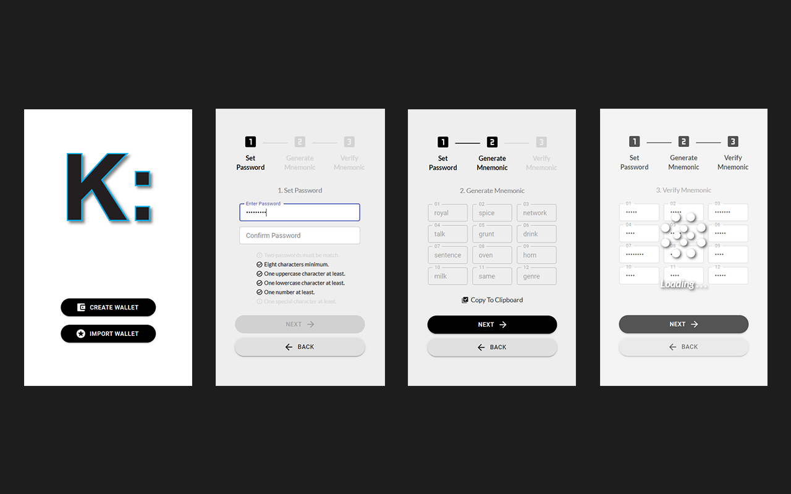
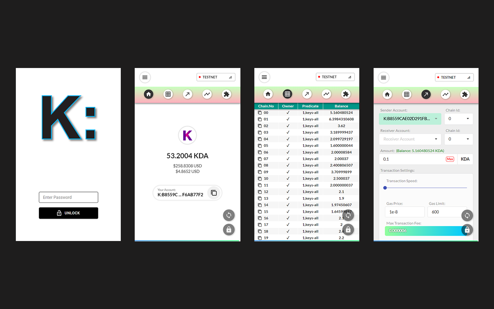
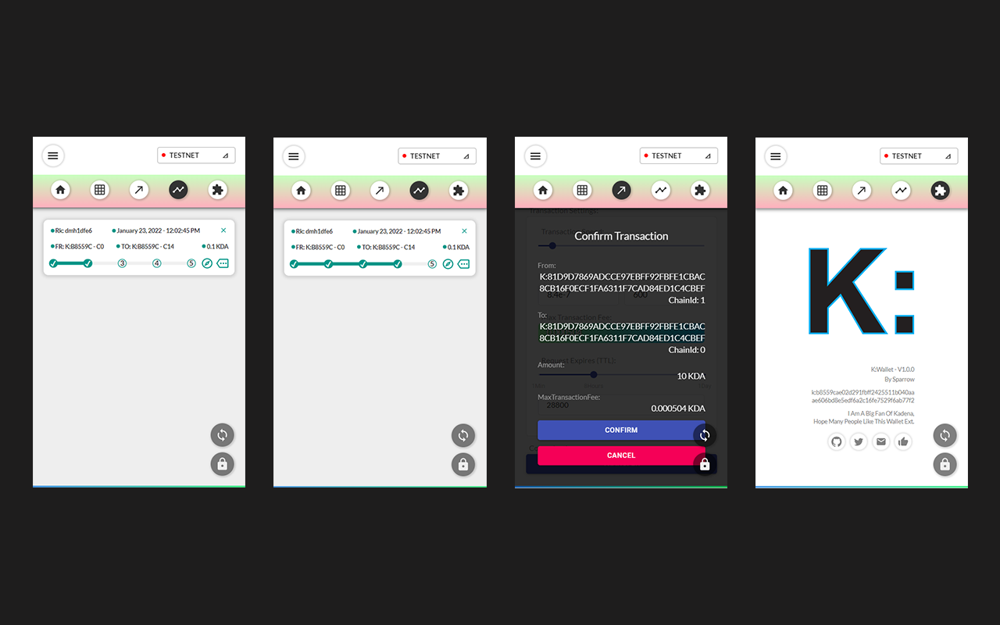
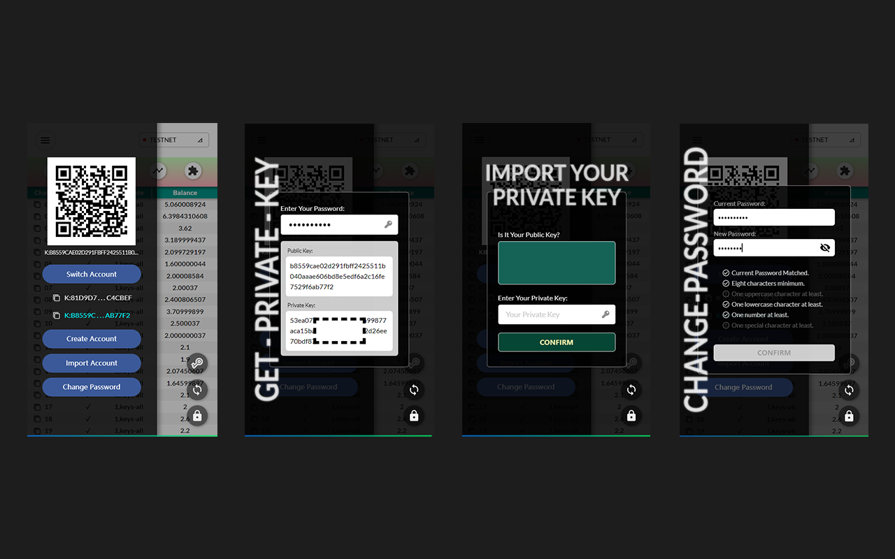
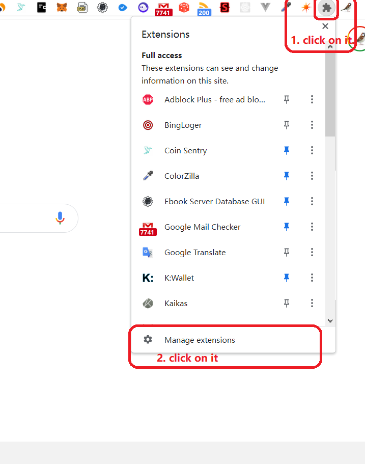
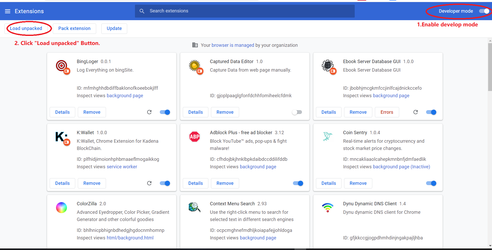
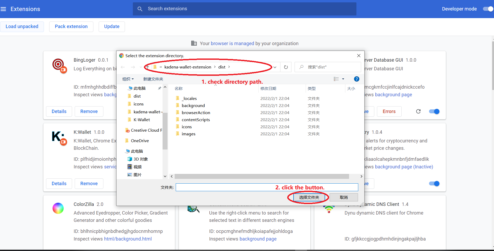

#
# K:Wallet (K Colon Wallet)
## Chrome extension, for the kadena blockchain.
#
#

- Very clean and simple for users to use. 
- Super stable crosschain-transfer, "finish cross transfer tool" is no longer required.
- Users can view their real private keys.
- Track transfer transactions throughout the process.
- All user's data stored into user's browser storage and indexeddb.
- 100% open source project.
###
#
Donate:
k:b8559cae02d291fbff2425511b040aaae606bd8e5edf6a2c16fe7529f6ab77f2
#
#

#
#
# 
# How to install the unpacked extension in Chrome
#

<pre>

<h1>I.</h1>
 

<h1>II.</h1>
 

<h1>III.</h1>
 
</pre>

#
#
# 
# How to download
#

 

